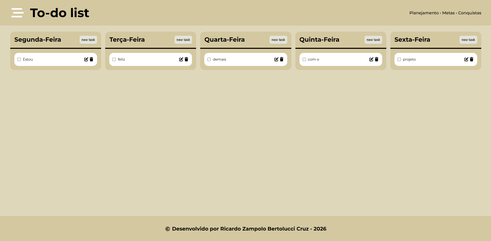

# To-do List

Uma lista de tarefas semanal desenvolvida com HTML, CSS e JavaScript puro. Permite adicionar, editar e remover tarefas organizadas por dia da semana, com persistência dos dados no navegador via localStorage.



## Funcionalidades

- Organização de tarefas por dia da semana (segunda a sexta)
- Adicionar novas tarefas através de um modal
- Editar tarefas existentes reutilizando o mesmo modal
- Remover tarefas individualmente
- Validação que impede criar tarefas vazias
- Persistência dos dados no localStorage — as tarefas permanecem salvas após recarregar a página
- Scroll interno em cada card quando há muitas tarefas
- Layout responsivo para diferentes tamanhos de tela

## Tecnologias utilizadas

- HTML5
- CSS3 (Flexbox e Grid)
- JavaScript (Vanilla JS)
- Font Awesome (ícones)
- Google Fonts (Montserrat)

## Como executar

1. Clone o repositório:
   ```bash
   git clone https://github.com/RicardoBertolucci/Lista-de-Tarefas.git
   ```
2. Abra o arquivo `index.html` no navegador.

Não requer instalação de dependências ou servidor.

## Conceitos praticados

- Manipulação dinâmica do DOM (`createElement`, `append`)
- Event delegation com um único `addEventListener`
- Uso de `closest` para navegar na árvore do DOM, incluindo o tratamento de cliques em ícones SVG do Font Awesome
- Distinção entre a referência de um elemento e o seu valor
- Uso de variáveis globais para manter estado entre eventos diferentes
- Reutilização de um mesmo modal para os modos de criação e edição
- Persistência de dados com `localStorage`, `JSON.stringify` e `JSON.parse`
- Tratamento do caso em que não há dados salvos (primeiro carregamento)
- Metodologia BEM para nomenclatura de classes CSS

## Estrutura do projeto

```
├── index.html
├── css/
│   └── style.css
└── js/
    └── script.js
```

## Melhorias futuras

- [ ] Marcar tarefas como concluídas via checkbox
- [ ] Adicionar sábado e domingo
- [ ] Filtrar ou ordenar tarefas
- [ ] Animações de transição ao adicionar e remover tarefas
- [ ] Separar a lógica em módulos

## Autor

Feito por [Ricardo Zampolo Bertolucci Cruz](https://github.com/RicardoBertolucci) — parte de um roadmap de estudos rumo ao desenvolvimento fullstack com Node.js.